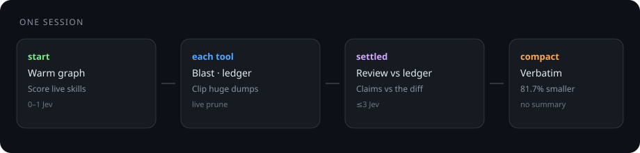
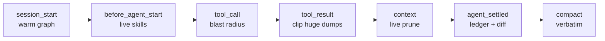
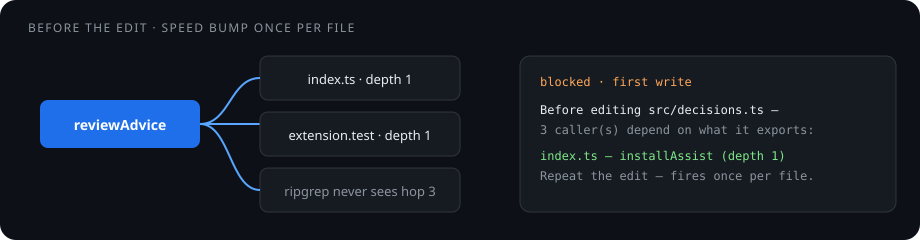
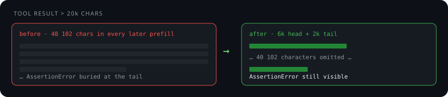

# pi-jev-assist

A [Pi](https://github.com/earendil-works/pi-mono) extension that checks an agent's work against **observation**, not against its own account of itself.

It runs by itself. No slash command to remember. Speaks when it has something; silent otherwise. Never edits your code, never certifies done, never starts a turn.

```
enumerate mechanically  →  classify with Jev  →  you decide
   git, ripgrep,            small, self-contained     authority never
   a call graph             items; abstention          moves
```

Every tool that asked Jev to **find** a defect failed its known-bad case. Every tool that asked it to **rank or score** pre-enumerated evidence discriminated.





A diff shows what code **says**, never that it **works**. Tests remain the only authority on behaviour.

---

## Pre-write blast radius

`tool_call` is the only hook that runs **before** a change and can block. Unconsidered callers were **12% of blocking** review findings in 1,252 comments. A check after the diff is too late.

Speed bump, not a gate: once per file per session. Re-issue the edit and it proceeds. Fails open if the graph is down.



What Pi shows on the first `edit` of a `.ts` file:

```
Before editing src/decisions.ts — 3 caller(s) depend on what it exports:
  index.ts — installAssist (depth 1)
  test/extension.test.ts — harness (depth 2)

From the Vortex call graph, mechanically. Check these still work, then
repeat the edit — this fires once per file.
```

Vortex when present (transitive `Calls`, including callers that **never mention** the symbol). Without it, bundled ripgrep covers the same ground **and says so**.

---

## Clip huge dumps

A 48k test log sits in **every later prefill**. Over 20k characters: keep 6k head + 2k tail. No Jev, ~0 ms. Failure at the **end** of the log still shows.



What the model actually receives:

```
<first 6000 characters of bun test>

… 40102 characters omitted (head+tail kept; re-run the tool if you need the middle)

FAIL  src/guard.test.ts
AssertionError: expected 200, got 403
```

Measured on six real sessions: **0–29%** of tool-result characters (zero when nothing was that large).

---

## Live prune

Same Jev questions as compaction, but **every turn** after ≥8k of finished tool output — you do not wait for `/compact`. Last 6 messages pinned. Fail-open.

Notify:

```
Jev live-pruned 8 tool result(s); 43% smaller context.
```

A dropped result in history becomes:

```
[tool output dropped as finished, 4120 chars; re-run the tool if needed]
```

| Slice | Cut |
| --- | --- |
| Live Jev, last 40 messages | **43%** of judged tool text · **14%** of the slice |
| Drop all but last 6 (upper bound, 5.6MB session) | **~21%** of the session |

---

## Verbatim compaction

Pi’s default compact **summarises**. A summary loses the path, the error string, the constraint. This **selects**: survivors are byte-for-byte.

Real 60-message span: **130,464 → 23,921 characters (81.7% smaller)**. User constraints intact word for word.

```
# Earlier context, pruned rather than summarised

Kept text is VERBATIM. Only finished tool output was removed.

## User
Fix the failing test. Never edit src/generated.

- read({"path":"src/a.ts"}) → ok, 4000 chars, output dropped as finished
```

Falls back to Pi’s summariser if saving &lt;25%, Jev fails, split turn, or there is no tool output to prune.

---

## Skill suggestions

Scores the catalogue Pi is **actually advertising this run**, not `~/.pi/skills`. At most two above **0.90**. Name and path only — never model-authored instructions. Over 128 skills: abstain, do not secretly shortlist.

Stripping unused skills from the system prompt was tried. At 0.90 it dropped **jev-review on a PR-triage prompt**. Suggestion-only stays.

---

## Evidence ledger

Every tool call is paired with its result by id. Redact **before** clip. `.env`, `auth.json`, `.ssh/`, `*.pem`, credential dumps: **withheld entirely**. Bounded: 120 entries, 300-char commands, 1,200-char excerpts.

`isError` is the only status Pi gives. The ledger never pretends `bun test` “passed”.

---

## Settled review

When the run goes idle on a clean `stop`, the final message is checked against the **ledger** and, if files changed, against the **working-tree diff**. Callers of what changed are ranked. Wrap-up prose with no check does not fire. Chrome that prints every turn gets ignored — only flags speak.

What you see when it disagrees:

```
Possible unresolved failure behind a completion claim: re-read the
failing output; an unrelated command that did not error is insufficient.
Advisory Jev signal, not verification. Tests, project rules and
permissions remain authoritative.
Acknowledge each point above before continuing: accept it and act, or
reject it and say on what evidence.
```

Claim checking: structural claims discriminate (5/6 on PR #989). “Revokes already-poisoned payloads” scored **0.84 on a miss** — absence is detection, where this fails. A `⚠ overstated` under a tick is a stop.

---

## What we tried for tokens and speed

| Experiment | Result | |
| --- | --- | --- |
| Clip dumps &gt;20k | 0–29% of tool chars · ~0 ms | **shipped** |
| Live prune | 14% of a 40-msg slice | **shipped** |
| Code-owned plan; Jev only “enough?” | Quality **3/3** · 7.2k vs 39.5k Pi · 1.6s vs 42s | pattern |
| Jev picks the next tool | **0/3** quality · faster and wrong | no |
| Rerank `rg` lines | Dropped `function reviewAdvice` | no |
| Rank files from paths | Every file ~0.58 · kept nothing | no |
| Strip skills below 0.90 | Dropped jev-review | no |

Jev classifies supplied evidence. It must not find, plan, or delete skills.

---

## Install

```sh
git clone <this repo> ~/Projects/pi-jev-assist
cd ~/Projects/pi-jev-assist && bun install
ln -s ~/Projects/pi-jev-assist ~/.pi/agent/extensions/jev-assist
```

`TYPESAFE_API_KEY` or owner-only `~/.config/typesafe/env` (`KEY=value`, parsed, never sourced). Restart Pi. `/jev-assist status`.

| | |
| --- | --- |
| `/jev-assist status` | Model, usage, on/off |
| `/jev-assist off` | `~/.pi/agent/jev-assist/config.json` |
| `PI_JEV_ASSIST=off` | Env kill switch wins |

Vortex optional. Bounds (tested): **2.5 s**, **48 kB**/request, **6**/run **300**/session, breaker after 3 failures, redact then clip.

```sh
bun run check
```

[architecture](docs/architecture.md) · [measurements](docs/measurements.md) · [limitations](docs/limitations.md) · [vortex](docs/vortex.md) · [upstream](UPSTREAM.md)

MIT.
